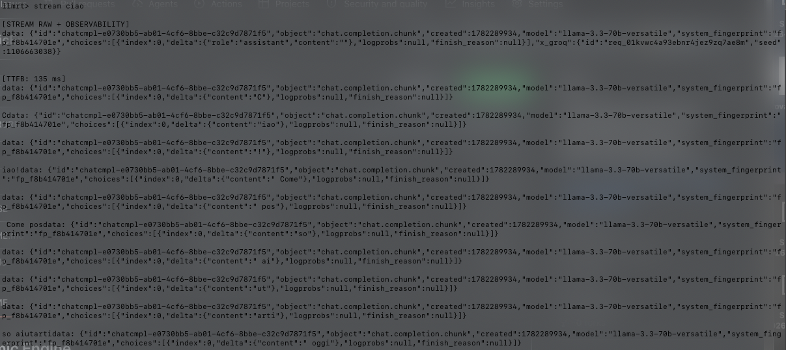

## Cosmic Engine

AI runtime written in C/C++ with optional Python tooling for image generation.
Overview
Cosmic Engine is a modular AI orchestration runtime designed to unify multiple inference backends under a single C/C++ core.
It currently supports:
LLM inference via Groq API
HTTP backend abstraction layer
Stub interface for local model execution (Ollama integration planned)
The architecture is designed around a minimal core engine with pluggable providers.

## Requirements

System

clang or gcc

make

libcurl

Python (optional, image pipeline only)

Python ≥ 3.9

requests

pillow

## Configuration

Groq API Key (required)

huggingface token ( required )

export HF_TOKEN="hf_Hjxxxxxx" huggingface token

GROQ_API_KEY=xxx ./llmrt

## Features

C/C++ runtime core

Groq API integration

Streaming SSE support

Raw chunk inspection

TTFB latency metrics

Multi-provider architecture

Python image generation support

HuggingFace integration

Ollama-compatible architecture

Modular backend design

## Current Providers

Text Providers

Groq

Ollama (planned / partial integration)

OpenRouter (planned)

Gemini (experimental)

## Image Providers

HuggingFace Inference API

## Streaming Engine

CosmicEngineAI includes a real-time streaming runtime for observing LLM responses at transport level.

The engine currently supports:

Server-Sent Events (SSE)

Raw JSON chunk inspection

Delta content extraction

TTFB measurement

Runtime telemetry

Example stream output:

[stream] ciao

[TTFB: 135 ms]

data: {"id":"chatcmpl-e0730bb5-ab01-4cf6-8bbe-c32c9d7871f5","object":"chat.completion.chunk","created":1782289934,"model":"llama-3.3-70b-versatile","system_fingerprint":"fp_f8b414701e","choices":[{"index":0,"delta":{"content":"iao"},"logprobs":null,"finish_reason":null}]}

data: {"id":"chatcmpl-e0730bb5-ab01-4cf6-8bbe-c32c9d7871f5","object":"chat.completion.chunk","created":1782289934,"model":"llama-3.3-70b-versatile","system_fingerprint":"fp_f8b414701e","choices":[{"index":0,"delta":{"content":"so"},"logprobs":null,"finish_reason":null}]}

## Runtime Observability

The runtime exposes low-level metadata during generation:

model identifiers

request ids

timing information

chunk stream visibility

This allows inspection of provider behavior and streaming performance directly from terminal.

## usage 

GROQ_API_KEY=xxx ./llmrt llm prompt 

image generator new terminal 

use menu.sh setup python venv

source venv venv/bin/activate

python3 run_img.py prompt 
